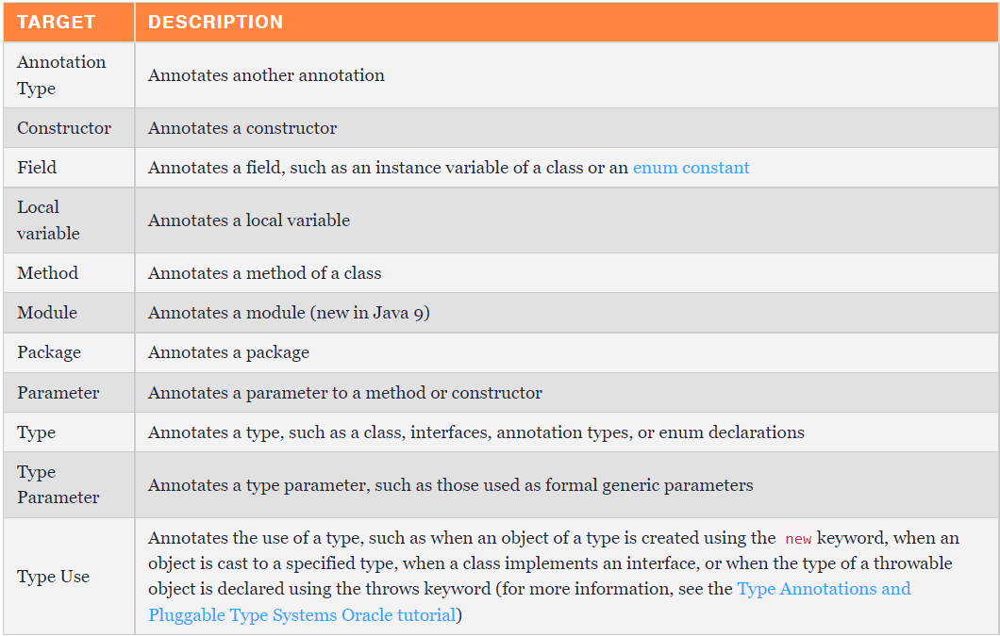

# Java 6 Overview
Java 6 release on December 11, 2006 with the following new feature and enhancements:

| Feature List                                                             |
|--------------------------------------------------------------------------|
| [Scripting Language Support](#scripting-language-support)                                   |
| [Performance improvements](#performance-improvements)               |
| [JAX-WS](#jax-ws) |
| [JDBC 4.0](#jdbc-40)                                         |
| [Java Compiler API](#java-compiler-api)                                   |
| [JAXB 2.0 and StAX parser](#jaxb-20-and-stax-parser)                                   |
| [Pluggable annotations](#pluggable-annotations)                                   |
| [New GC algorithms](#new-gc-algorithms)                                   |

## Scripting Language Support
- Scripting languages are programming languages that support the ability to write scripts. Unlike source files for other programming languages that must be compiled into **bytecode** before you run them, scripts are evaluated by **a run-time environment** (in this case, by **a script engine**) directly.

- Most scripting languages are dynamically typed. This enables you to create new variables without declaring the variable type (the interpreter assigns the type based on the type of the object associated with the variable), and you can reuse the same variable for objects of different types (type conversion is performed automatically).

- Scripting languages generally have simple syntax; they allow complex tasks to be performed in relatively few steps. [[Source]](https://docs.oracle.com/javase/10/scripting/scripting-languages-and-java.htm#JSJSG107)

- In the below example, the ScriptEngine execute the scripting line **"print('hello world')"**

```java
    public static void main(String[] args) throws ScriptException {
        ScriptEngineManager manager = new ScriptEngineManager();
        ScriptEngine engine = manager.getEngineByName("nashorn");
        engine.eval("print('Hello, World')");
    }
```

- Running script from a file
```java
    public static void main(String[] args) throws ScriptException, FileNotFoundException {
        ScriptEngineManager manager = new ScriptEngineManager();
        ScriptEngine engine = manager.getEngineByName("js");
        engine.eval(new FileReader(System.getProperty("user.dir") + "/src/main/resources/" + "script.js"));
    }
```

## Performance improvements

#### 1. Synchronization performance optimizations

**Biased locking by default**
> Biased Locking is a class of optimizations that improves uncontended synchronization performance by eliminating atomic operations associated with the Java language’s synchronization primitives. These optimizations rely on the property that not only are most monitors uncontended, they are locked by at most one thread during their lifetime.
> 
> An object is "biased" toward the thread which first acquires its monitor via a monitorenter bytecode or synchronized method invocation; subsequent monitor-related operations can be performed by that thread without using atomic operations resulting in much better performance, particularly on multiprocessor machines.
> 
> Locking attempts by threads other that the one toward which the object is "biased" will cause a relatively expensive operation whereby the bias is revoked. The benefit of the elimination of atomic operations must exceed the penalty of revocation for this optimization to be profitable.
> 
> Applications with substantial amounts of uncontended synchronization may attain significant speedups while others with certain patterns of locking may see slowdowns.
> 
> Biased Locking is enabled by default in Java SE 6 and later. To disable Biased Locking, please add to the command line **-XX:-UseBiasedLocking** . [[2]](https://www.oracle.com/java/technologies/javase/6performance.html)

**Lock coarsening**
> The lock coarsening optimization technique implemented in hotspot eliminates the unlock and relock operations in those situations (when a lock is released and then reacquired with no meaningful work done in between those operations). It basically reduces the amount of synchronization work by enlarging an existing synchronized region. Doing this around a loop could cause a lock to be held for long periods of times, so the technique is only used on non-looping control flow.
> 
> This feature is on by default. To disable it, please add the following option to the command line: **-XX:-EliminateLocks**


**Adaptive spinning**:
> Adaptive spinning is an optimization technique where a two-phase spin-then-block strategy is used by threads attempting a contended synchronized enter operation. This technique enables threads to avoid undesirable effects that impact performance such as context switching and repopulation of Translation Lookaside Buffers (TLBs). It is “adaptive" because the duration of the spin is determined by policy decisions based on factors such as the rate of success and/or failure of recent spin attempts on the same monitor and the state of the current lock owner.
> 

### 2. Compiler performance optimizations
> Prior to Java SE 6, the HotSpot Client compiler did not compile Java methods in the background by default. As a consequence, Hyperthreaded or Multi-processing systems couldn't take advantage of spare CPU cycles to optimize Java code execution speed. Background compilation is now enabled in the Java SE 6 HotSpot client compiler.
> 
> The HotSpot client compiler features a new linear scan register allocation algorithm that relies on static single assignment (SSA) form. This has the added advantage of providing a simplified data flow analysis and shorter live intervals which yields a better tradeoff between compilation time and program runtime. This new algorithm has provided performance improvements of about 10% on many internal and industry-standard benchmarks.

### 3. New Parallel Compaction Collector (GC)

**Parallel Compaction Collector**
> Parallel compaction is a feature that enables the parallel collector to perform major collections in parallel resulting in lower garbage collection overhead and better application performance particularly for applications with large heaps. It is best suited to platforms with two or more processors or hardware threads.
> 
> Previous to Java SE 6, while the young generation was collected in parallel, major collections were performed using a single thread. For applications with frequent major collections, this adversely affected scalability.
> 
> Parallel compaction is used by default in JDK 6, but can be enabled by adding the option -XX:+UseParallelOldGC to the command line in JDK 5 update 6 and later.

**Concurrent Low Pause Collector: Concurrent Mark Sweep Collector Enhancements**
> The Concurrent Mark Sweep Collector has been enhanced to provide concurrent collection for the System.gc() and Runtime.getRuntime().gc() method instructions. Prior to Java SE 6, these methods stopped all application threads in order to collect the entire heap which sometimes resulted in lengthy pause times in applications with large heaps. In line with the goals of the Concurrent Mark Sweep Collector, this new feature is enabling the collector to keep pauses as short as possible during full heap collection.
> 
> To enable this feature, add the option -XX:+ExplicitGCInvokesConcurrent to the Java command line.


## JAX-WS
```java

@WebService
public class CircleFunctions {
   public double getArea(double r) {
       return java.lang.Math.PI * (r * r);
    }

   public double getCircumference(double r) {
        return 2 * java.lang.Math.PI * r;
    }
}

public static void main(String[] args) {

      Endpoint.publish(
         "http://localhost:8080/WebServiceExample/circlefunctions",
         new CircleFunctions());

}
```

## JDBC 40
- Some new feature:
 1. New implementations of **javax.sql.DataSource**.
 2. Auto-loading of JDBC driver
 3. SQLExpception **fine-grains**: 
    - java.sql.SQLClientInfoException
    - java.sql.SQLDataException
    - java.sql.SQLFeatureNotSupportedException
    - java.sql.SQLIntegrityConstraintViolationException
    - java.sql.SQLInvalidAuthorizationSpecException
    - java.sql.SQLSyntaxErrorException
    - java.sql.SQLTransactionRollbackException
    - java.sql.SQLTransientConnectionException   

## Pluggable annotations
> Annotations have been there in the Java World from Java 5.0. Java Annotations are a result of the JSR 175 which aimed in providing a Meta-Data Facility to the Java Programming Language. It can be greatly used by the Build-time Tools and Run-time Environments to do a bunch of useful tasks like Code Generation, Validation and other valuable stuffs. Java 6 has introduced a new JSR called JSR 269, which is the Pluggable Annotation Processing API. With this API, now it is possible for the Application Developers to write a Customized Annotation Processor which can be plugged-in to the code to operate on the set of Annotations that appear in a Source File. [[Source]](https://javabeat.net/java-6-0-features-part-2-pluggable-annotation-processing-api/)

> **Java annotation have no effect at runtime**.

Creating an annotation requires two pieces of information: 
* (1) a retention policy 
* (2) a target.

A retention policy specifies how long, in terms of the program lifecycle, the annotation should be retained for:
- **Source**: Annotations are discarded by the compiler
- **Class**: Annotations are recorded in the class file generated by the compiler but are not required to be retained by the Java Virtual Machine (JVM) that processes the class file at runtime
- **Runtime**: Annotations are recorded in the class file by the compiler and retained at runtime by the JVM

The target of an annotation specifies which Java constructs an annotation can be applied to.



Code sample:
```java
@Retention(RetentionPolicy.RUNTIME)
@Target(ElementType.FIELD)
public @interface JsonField {
    public String value() default "";
}

public class Car {
    @JsonField("manufacturer")
    private final String make;

    @JsonField
    private final String model;

    public Car(String make, String model) {
        this.make = make;
        this.model = model;
    }
}


public class JsonSerializer {

    public String serialize(Object object) {
        try {
            Class<?> objectClass = requireNonNull(object).getClass();
            Map<String, String> jsonElements = new HashMap<>();

            for (Field field: objectClass.getDeclaredFields()){
                field.setAccessible(true);
                if(field.isAnnotationPresent(JsonField.class)){
                    jsonElements.put(getFieldKey(field), String.valueOf(field.get(object)));
                }
            }
            String result = toJson(jsonElements);
            System.out.println(result);
            return result;
        } catch (IllegalAccessException e) {
            throw new JsonSerializeException(e.getMessage());
        }
    }

    private static String toJson(Map<String, String> jsonElements ){
        return "{" + jsonElements.entrySet()
                           .stream()
                           .map(entry -> entry.getKey() + ":" + entry.getValue())
                           .collect(Collectors.joining(",")) + "}";
    }

    private static String getFieldKey(Field field){
        String annotationValue = field.getAnnotation(JsonField.class).value();
        return annotationValue.isEmpty() ? field.getName() : annotationValue;
    }
}

/* Main class */
public class s6main {
    public static void main(String[] args) {
        Car car = new Car("Ford", "f10");
        JsonSerializer serializer = new JsonSerializer();
        String result = serializer.serialize(car);
        // print {model:f10,manufacturer:Ford} 
    }
}

```

## New GC algorithms
