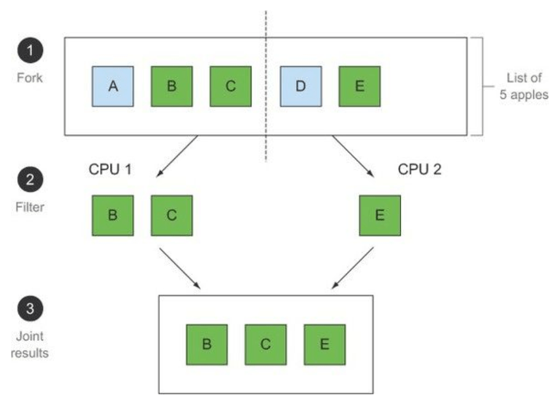

# Java 8 Overview
Java 8 release on March 2014 with the following new feature and enhancements:

| Feature List                                                             |
|--------------------------------------------------------------------------|
| [Default and static methods in Interfaces](#default-and-static-methods-in-interfaces)           |
| [Java Time API](#java-time-api)               |
| [forEach() method in Iterable interface](#foreach-method-in-iterable-interface)                                       |
| [Functional Interfaces and Lambda Expressions](#functional-interfaces-and-lambda-expressions)                         |
| [Java Stream API for Bulk Data Operations on Collections](#java-stream-api-for-bulk-data-operations-on-collections)   |

## Default and static methods in Interfaces
- In java 8, method in interface can have **default** implementation, in stead of force class that implement them to do so. This feature is added for ensure backward compatibility.

- Consider the example below, we have interface **Alert** and class **ControlPanel** implement them :
```java
interface Alert {
    void alarm();
}

class ControlPanel implements Alert {
    @Override
    public void alarm() {
        System.out.println("ACTUNG !");
    }
}
```
- Let assume after reconsidering, owner of **Alert** interface would like to add a new method call **dismiss**:
```java
interface Alert {
    void alarm();
    void dismiss();
}

class ControlPanel implements Alert { // Compile fail
    @Override
    public void alarm() {
        System.out.println("ACTUNG !");
    }
}
```
- Above code will not compile because **ControlPanel** not implement method **dismiss** yet. In order to don't force client code to implement every single method we can use **default** method in interface.
```java
interface Alert {
    void alarm();
    default void dismiss(){
        System.out.println("Dismiss");
    }
}

class ControlPanel implements Alert {
    @Override
    public void alarm() {
        System.out.println("ACTUNG !");
    }
}
```
- This code new work because method **dismiss** now have an implementation, if client code don't intentionally override this method, the default implementation will be used.

- **Note**: If a class implements 2 interfaces and all of them have a default common method than the class have to override and implement the default method itself.

- In addition to declaring default methods in interfaces, Java 8 also allows us to define and implement **static** methods in interfaces. Access this method by using name interface + method name.

```java
public interface Arlam {
    static printArlamMessage(){
        System.out.println("Arlam !");
    }
}

Arlam.printArlamMessage(); // print Arlam !
```

## Java Time API
- Java 8 introduce new time utility package **java.time** that handle the issue of the old **java.util** package such as:
    - Thread safety.
    - API design and convention.
    - Zone time.
    
- **LocalDate, LocalTime and LocalDateTime** time and date without a time zone base on ISO-8601 standard.

```java
static void testTime(){
        // construct LocalDate
        LocalDate date = LocalDate.of(2021, Month.APRIL, 10);
        printTime(date);
        // construct LocalDate from string
        LocalDate stringDate = LocalDate.parse("2022-01-12");
        printTime(stringDate);
        // tomorrow
        LocalDate tomorrow = LocalDate.now().plusDays(1);
        printTime(tomorrow);

        // now
        LocalTime now = LocalTime.now();
        // construct LocalTime
        LocalTime sixThirty = LocalTime.of(6, 30);
        // construct LocalTime from String
        LocalTime sixThirtyString = LocalTime.parse("06:30");
    }

    static void testZoneTime(){
        Set<String> allZoneIds = ZoneId.getAvailableZoneIds();
        for(String zoneId : allZoneIds.toArray(String[]::new)){
            System.out.println(zoneId);
        }

        ZoneId zoneId = ZoneId.of("Europe/Paris");
        ZonedDateTime zonedDateTime = ZonedDateTime.of(LocalDateTime.now(), zoneId);
    }

    static void testPeriod(){
        LocalDate initialDate = LocalDate.parse("2007-05-10");
        LocalDate finalDate = initialDate.plus(Period.ofDays(5));
        int days = Period.between(initialDate, finalDate).getDays();
        System.out.println("Period " + days);
    }

    static void testDuration(){
        LocalTime initialTime = LocalTime.parse("06:30");
        LocalTime finalTime = initialTime.plus(Duration.ofHours(5));
        long seconds = Duration.between(initialTime, finalTime).getSeconds();
        System.out.println("Duration " + seconds);
    }

    static void testConvertOldDate(){
        Date oldDate = new Date();
        LocalDate newDate = LocalDate.ofInstant(oldDate.toInstant(), ZoneId.systemDefault());
        System.out.println(newDate.toString());
    }
```

## forEach method in Iterable interface
- In java 8, class with **Iterable** interface can use **forEach(Consumer<? super T> action)** in order to perform any action for all elements of collections.

```java
    static void testForEach(){
        List<String> listString = new ArrayList<>(Arrays.asList("TCB", "ACB", "TPC"));
        listString.forEach(System.out::println);
        Set<String> setString = new HashSet<>(Arrays.asList("TCB", "ACB", "TPC"));
        setString.forEach(System.out::println);
    }   
```

## Java Stream API & Lambda expression and Functional programming.

### Introductory overview:
- Java 8 introduce **Stream** API that support parallel operation to process data. **Stream** API help us to avoid synchronized, which is error-prone and more expensive in multicore CPUs. **Stream < T >** is a sequence of items of type T. Streams API has many methods that can be chained to form a complex pipeline. Java 8 can transparently run your pipeline of Stream operations on several CPU cores on disjoint parts of the input—this is parallelism almost for free instead of hard work using Threads.

- Another programming concept add the java 8 is the ability to **pass a piece of code to an API**. For example we want to sort a list string by a customized function (sort by the last n letter for example), Prior to java 8 we can use **Comparator** to implement such feature, however it is quite **verbose and obfuscates**. Java 8 adds the ability to pass methods (your code) as arguments to other methods as **behavior parameterization**.

- Java 8 also add feature of **parallel** into stream processing, in order to utilize parallelism for stream processing, we must provide behavior that is safe to execute concurrently on different pieces of the input, or in order words, **code that don't access shared mutable data or can be refer as pure function**. 

- Java 8 streams exploit parallelism more easily than Java’s existing Threads API, so although it’s possible to use synchronized to break the no-shared-mutable-data rule, it’s fighting the system in that it’s abusing an abstraction optimized around that rule. Using synchronized across multiple processing cores is often far more expensive than you expect, because synchronization forces code to execute sequentially, which works against the goal of parallelism.



- Two of these points (**no shared mutable data and the ability to pass methods and functions—code—to other methods**) are the cornerstones of what’s generally described as the paradigm of **functional programming**. In contrast, in the imperative programming paradigm you typically describe a program in terms of a sequence of statements that mutate state. The no-shared-mutable-data requirement means that a method is perfectly described solely by the way it transforms arguments to results; in other words, it behaves as a mathematical function and has no (visible) side effects.

- Another concept we should explore is **First class values** and **Second class values**, in java primitive values and objects are **First class values** and they can be **passed in method during runtime execution**. In other hand, function and classes are **second class values**. Java 8 offer us a way to pass function as first class value via method reference or using lambda syntax. 


### Behaviour parameterize:
- For example we have a function that sort an array of object **Apple** by their color and weight:
```java
class Apple {
        int weight;
        String color;
    
        // Constructor, getter, setter, toString ...
    }

    static void filter(List<Apple> list){
        List<Apple> result = new ArrayList<>();
        for (Apple apple : list){
            if (apple.getColor().equals("red") || apple.getWeight() > 150){
                result.add(apple);
            }
        }
        System.out.println(result.toString());
    }

```
- The above function filter is less readable hard to extend, what if **Apple** not only have weight and color but many many other attribute. One way to mitigate this modeling the criteria for filter **Apple** using interface
```java
    interface ApplePredicate {
        boolean test(Apple apple);
    }
    
    class AppleRedAndHeavyPredicate implements ApplePredicate{
        public boolean test(Apple apple){
            return "red".equals(apple.getColor()) && apple.getWeight() > 150;
        }
    }

    static void filter(List<Apple> list, ApplePredicate predicate){
        List<Apple> result = new ArrayList<>();
        for (Apple apple : list){
            if (predicate.test(apple)){
                result.add(apple);
            }
        }
        System.out.println(result.toString());
    }
    
    public static void main(String[] args) {
        List<Apple> list = new ArrayList<>();
        list.add(new Apple(165, "red"));
        list.add(new Apple(160, "green"));
        list.add(new Apple(160, "blue"));

        filter(list, new AppleRedAndHeavyPredicate());
    }    
```
- This code now is a bit cleaner now, we model the sorting criteria with interface **ApplePredicate** and implement new class **AppleRedAndHeavyPredicate**, then when filter we just need to instantiate this class.

- This can be even less verbose with **Anonymous class**, Java has a mechanism called anonymous classes, which let you declare and instantiate a class at the same time. They enable you to improve your code one step further by making it a little more concise.

```java
        filter(list, new ApplePredicate() {
            @Override
            public boolean test(Apple apple) {
                return "red".equals(apple.getColor()) && apple.getWeight() > 150;
            }
        });
```

- Finally, in java 8 with lambda function, this code can be shorten as:
```java
    filter(list, apple -> "red".equals(apple.getColor()) && apple.getWeight() > 150);
```


### Lambda expressions